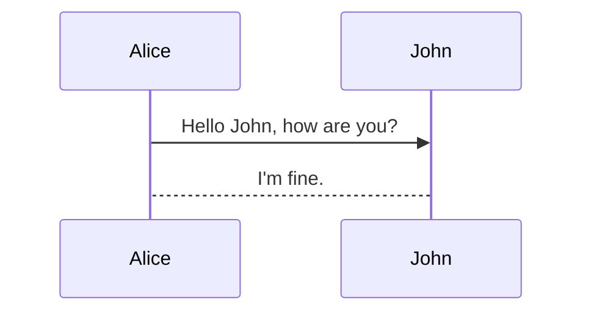

# Realization Principle

Typora itself doesn't have the ability to paint, but it provided support of **Mermaid**.

**Mermaid** is a scripting language  which can 

convert text to an image by JavaScript.

It support many kinds of painting, such as Sequence diagram, Flowchart, Class diagram, Gantt chart and so on.

# Using method

Inputing:

```typora
```mermaid
```

on Typora. Enter and then you will initialize a blank image:

```mermaid
```

## flowchart

Using the keyword "graph":

```typora
graph TD;
	A --> B;
	A --> C;
	B --> D;
	C --> D;
```

"TD" means the **direction**: from **Top** to **Down**


## Sequence Diagram

Using the keyword "sequenceDiagram":

```typora
sequenceDiagram
	Alice -> John: Hello John, how are you?
	John --> Alice: I'm fine.
```

* Solid lines use only one "-" and dotted lines use two.
* The arrow should be represented with two ">" symbols.



## State Diagram

Using the keyword "stateDiagram":

```typora
stateDiagram
	[*] --> S1
	S1 --> [*]
```

* [*] means start or end

[待完成](https://www.zhihu.com/zvideo/1294240754269958144)

