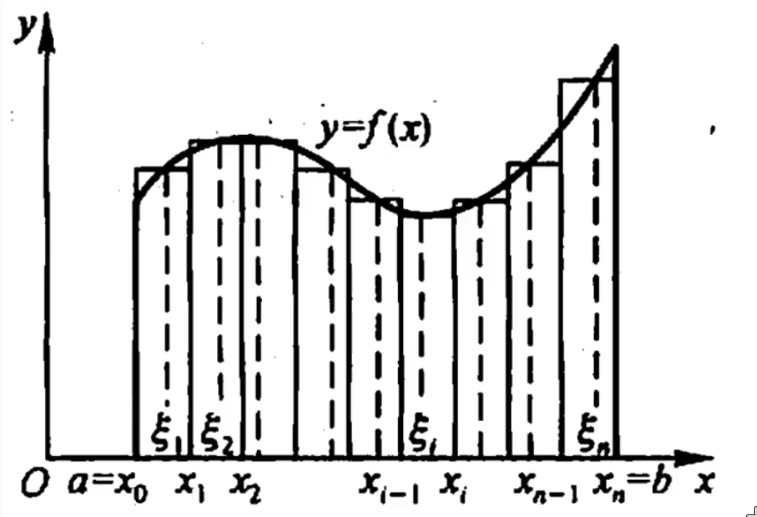
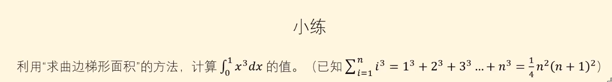
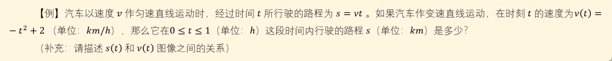
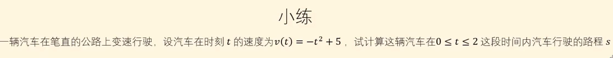
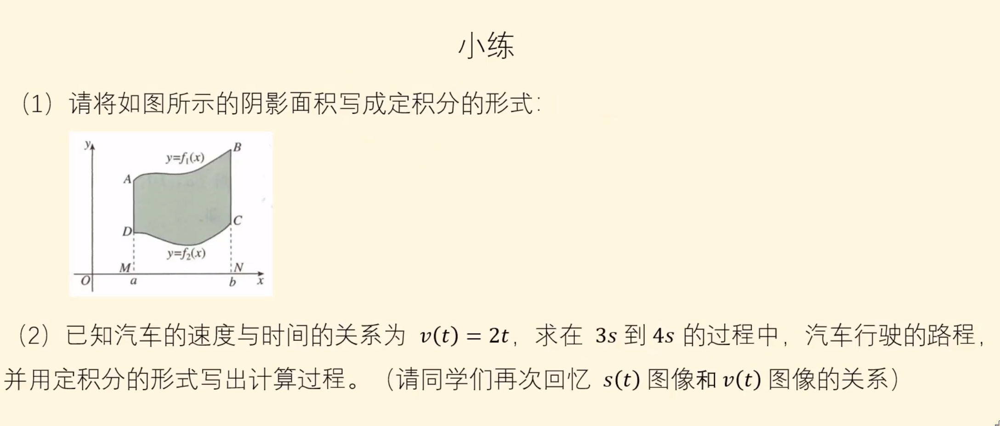
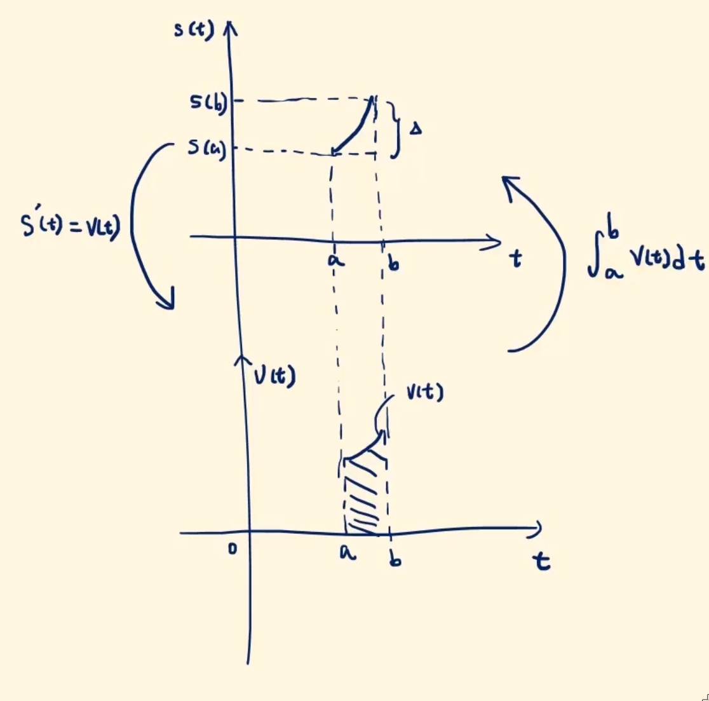
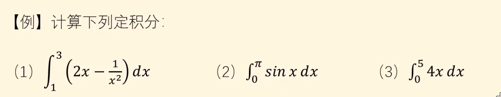

# 幼儿园微积分

## 曲边梯形面积

面对不规则图像求解面积如：

其中曲边的函数表达式已知.

### 思路

因为对于这个梯形，它的高是连续变化的，也就是f(x)在所求区间内是**连续的**. 所以对于非常小的区间内，高的变化量也是很小的.

也就是当$\Delta x \to 0时，\Delta y \to 0$.我们可以近似认为其变化量为0.

我们在两个确定的x中，任取一个点，记作$\xi$,则它们组成的矩形可以近似梯形的一部分，面积为$f(\xi)\Delta x$当两个x的差值$\to$0时，则我们就可以看作是梯形的一部分.

则梯形的面积可以表示为**所有窄矩形的和**.

### 求解

那接下来就正式开始求解它的面积了：

1. 切割成微元

​	在(a,b)中插入若干分点（$x_1,x_2,x_3\dots x_{n-1},x_n$）

​	这些点把区间(a,b)分为了若干个小区间.它们的长度都为$\Delta x_i=x_i-x_{i-1}$

​	这样我们就得到了若干个以$\Delta x$为底，$f(\xi)$为高的窄矩形. 面积为$\Delta s_i=f(\xi)\cdot \Delta x_i$

2. 求和取极限

​	接下来我们要把梯形切割为**无限份**，从而保证矩形和无限趋近于梯形
$$
A=\sum\limits_{i=1}^{n}\Delta s_i=\sum\limits_{i=1}^n f(\xi_i)\Delta x_i\\
A=\lim\limits_{n \to \infty}\sum\limits_{i=1}^n f(\xi_i)\Delta x_i\\
$$
​	于是上述表达式就是定积分的一种形式，我们将它写成标准形式：
$$
\int_{a}^{b}f(x)\cdot dx
$$
其中$\int$是求和的意思，$a,b$是区间的限度（要求的范围），dx就是$\Delta x$.

### 练习

$$
\int_0^1x^3dx=\lim\limits_{n \to \infty}\sum\limits_{i=1}^n\frac{1}{n}(\frac{i}{n})^3=\lim\limits_{n \to \infty} \frac{1}{4}+\frac{1}{2n}+\frac{1}{2n^2}=\frac{1}{4}
$$

## 变速直线运动的路程

一个物体做变速直线运动，已知速度与时间的函数关系式f(T)，T1到T2时间内物体从A运动到了B，求从物体运动的路程.

我们可以用和上一篇一样的**微元法**来进行求解.

列式为：
$$
\int_A^Bf(T)dt
$$

### 例题

$$
\int_0^1v(t)dt=\lim\limits_{n \to \infty}\sum_{i=0}^nf(\frac{i}{n})\frac{1}{n}=-\frac{1}{3}+2=\frac{5}{3}
$$

### 练习

太简单了，懒得写了，有空自己写着玩吧XD

## 定积分的定义

定义：

​	函数f(x)在[a,b]中插入若干分点，将[a,b]分为若干小区间，在每个小区间中取一个$\xi \in [x_{i-1},x_i]$，则有$I=f(\xi_I)\Delta x_i$

​	若$\lambda=_{max} \left\{\Delta x_1,\Delta x_2 \dots \Delta x_n\right\} \to 0$

​	则$I=\int_a^bf(x)dx=\lim\limits_{\lambda \to 0}\sum\limits_{i=1}^nf(\xi_i)\Delta x_i$

### 练习

(1)
$$
I=\int_a^b[f_1(x)-f_2(x)]dx
$$
(2)
$$
S=\int_3^4(2t)\cdot dt=7
$$

## 粗糙的牛顿莱布尼茨公式

*牛顿*和*莱布尼茨*发现

> 导函数的积分等于原函数的增量

例如原函数$f(x)=x^2$，则导函数为$f'(x)=2x$，则$\int_2^32x\cdot dx=3^2-2^2=5$

将它抽象出来则是：
$$
\int_a^bf'(x)dx=f(b)-f(a)
$$
这也就是**微积分的基本定理**

### 例题

1. $f(x)=2x-\frac{1}{x^2}$的原函数为$g(x)=x^2+x^{-1}$

​	所以
$$
\int_1^3(2x-\frac{1}{x^2})dx=3^2+\frac{1}{3}-(1^2+\frac{1}{1})=\frac{22}{3}
$$
其余求法一致.

