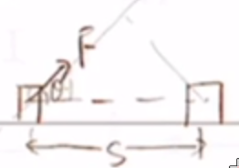
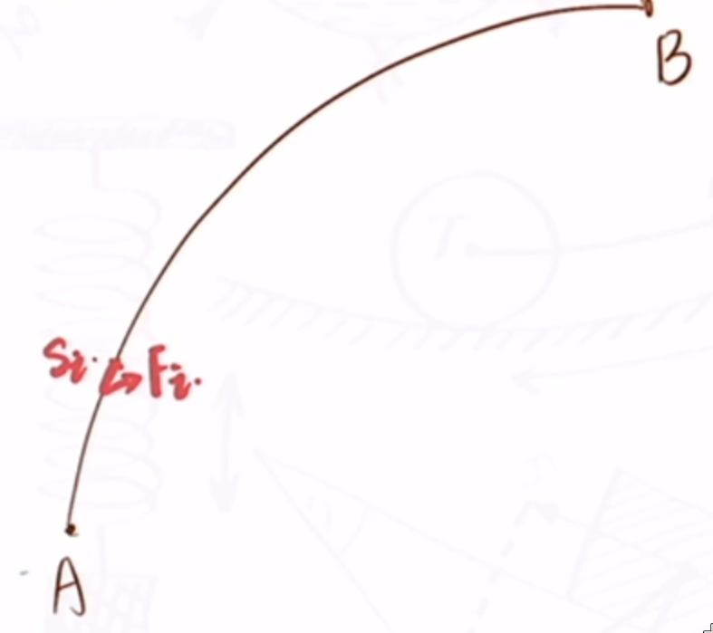

# 能量与动量

## 能量与功

### 功

功有两个含义：

1. **不同物体**之间的能量转移
2. **不同形式**之间的能量转化

功是个**标量**，其作为标量的理由和电流作为标量的理由一样：

[有三种方法](https://www.zhihu.com/question/49912871)可以进行解释：

第一种：

**对矢量定义的理解**

很多人会认为，功有正功、负功，分别代表能量的流入、流出，就是两个方向。事实上，这是对“方向”这个概念的理解错误

矢量（向量）的方向指的是空间上的方向，如东南西北等，而不是增加减少、流入流出这种抽象的方向。不然的话，其实所有的标量都可以增大减小，那么所有的变化量都是矢量了咯？

第二种：

 **对矢量运算法则的理解**

假设功是矢量，有方向，那么向南做的1J功和向西做的1J功合成应该遵循矢量合成的平行四边形法则——合成向西南的$\sqrt{2} J$功。但事实上，他是做了2J功。

第三种：

**对功计算式的理解**

功是F与S的点乘。两个向量的点积结果应该是数字。

所以功是标量.

对于功，如果一个物体受到一个与位移s方向成$\theta\degree$的力F. 则这个力对物体做的功为：
$$
W=F cos\theta \cdot s
$$

它既可以看作力沿位移的分量乘以位移，也可以看作位移沿力的分量乘以力.

所以：
$$
\begin{cases}
0\degree<\theta<90时，\degree w>0做正功（动力）\\
\theta=90时，\degree w=0不做功\\
90\degree<\theta\le180\degree时，\degree w<0做负功（阻力）
\end{cases}
$$

对于变力做功的计算：

如：

