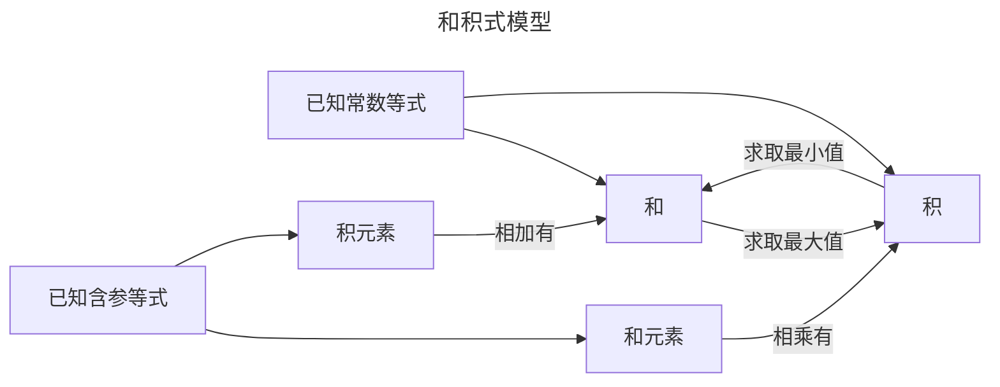
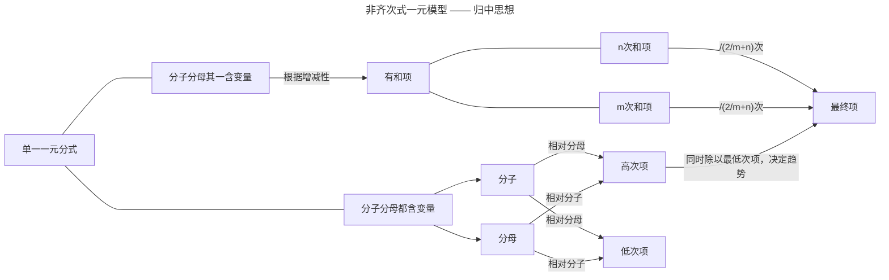
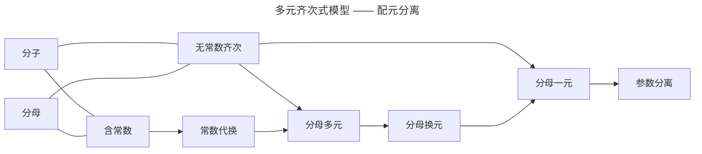

# 基本不等式基础篇

## 什么是基本不等式

推导:
$$
\because (\sqrt x - \sqrt y)^2 \ge 0\\
\therefore x+y-2\sqrt {xy} \ge 0\\
\therefore \frac{a+b}{2} \ge \sqrt{ab}
$$
基本不等式为:
$$
\frac{a+b}{2} \ge \sqrt{ab}(a \ge 0, b \ge 0)
$$

## 不等式取等问题

对于基本不等式，有：
$$
x+y \ge 2\sqrt {xy}\\
x+y-2\sqrt {xy} \ge 0\\
(\sqrt x - \sqrt y)^2 \ge 0
$$
易知，当x = y时，$x+y = 2\sqrt {xy}$

> 取等条件**非常关键**

结合取等条件，我们可以归纳出使用基本不等式的**基本步骤**：

1. $x,y \ge 0$
2. 验证是否$\exists {x = y}$

验证取等的**重要性**：

就用和积式的*例题1*为例：
$$
\text {解2:}\\
\because 2x^2 + 3y^2 = x^2 + y^2 + x^2 + 2y^2,xy =1 \\
\therefore 2x^2 + 3y^2 \ge 2\sqrt {x^2 \cdot y^2}+2\sqrt {x^2 \cdot 2y^2} = 2xy + 2\sqrt 2xy = 2+2\sqrt2
$$
可以发现，我们只是换了一种做法，使用了两次基本不等式，但是得出的答案却不同.

这就是没有验证取等条件可能会造成的.

具体问题：
$$
\text {对于解2,要使$x^2 + y^2 = 2xy,$则需要x = y}\\
\text {要使$x^2 + 2y^2 = 2\sqrt 2xy$,则需要$x^2 = 2y^2$}\\
\text {只有当x = y = 0时满足条件}\\
\because xy = 1\\
所以 \neg {x = y = 0}
$$

## 基本不等式的一般形式

### 和积式

#### 例题

1. 若实数x,y满足xy=1,则$2x^2+3y^2$的最小值为多少？
   $$
   \text 解1:\\
   2x^2 + 3y^2 \ge 2\sqrt {2x^2 \cdot 3y^2} = 2\sqrt {6x^2y^2} \\= 2\sqrt 6\\
   \therefore 2x^2+3y^2\text{的最小值为}2\sqrt 6
   $$

2. 已知正数a,b满足$\frac{1}{a}+\frac{2}{b} = 1$则ab最小值为多少？
   $$
   \text {解:}\\
   1 = \frac{1}{a}+\frac{2}{b} \ge 2\sqrt{\frac{1}{a}\cdot\frac{2}{b}}\\
   \therefore 1 \ge 2\sqrt{\frac{2}{ab}}\\
   \therefore ab \ge 8
   $$

3. 若实数a,b满足$\frac{1}{a}+\frac{2}{b}=\sqrt{ab}$,则ab的最小值为多少？
   
   $$
   \sqrt{ab} = \frac{1}{a}+\frac{2}{b} \ge 2\sqrt{\frac{2}{ab}}\\
   \therefore ab \ge 2\sqrt{2}
   $$
   
#### 考题

   1. 已知实数x,y满足2x+y=2,则$9^x+3^y$的最小值为多少？ 

$$
\text {解:}\\
\because 9^x + 3^y = 3^{2x} + 3^y\\
\therefore 9^x + 3^y \ge 2\sqrt {3^{2x+y}}\\
\because 2x +y = 2\\
\therefore 9^x + 3^y \ge 6
$$

### 非齐次式

#### 例题

1. 求$(2x + \frac{1}{x})_{min}$ (x>0)
   $$
   \text {解:}\\
   2x + \frac{1}{x} \ge 2\sqrt {2x \cdot \frac{1}{x}} = 2\sqrt 2
   $$

2. 求$(2x + \frac{1}{x -1})_{min}$ (x>1)
   $$
   \text {解:}\\
   2x + \frac{1}{x -1} = (2x -2) + \frac{1}{x -1} + 2\\
   \ge\\
   2\sqrt {(2x -2)\cdot \frac{1}{x-1}}+2 = 2\sqrt2 + 2
   $$

#### 考题

1. 设x>0, y>0 , x+2y = 5, 则$\frac{((x+1)(2y +1)}{\sqrt {xy}}$的最小值为多少？
   $$
   \frac{(x+1)(2y +1)}{\sqrt {xy}} = \frac{2xy+6}{\sqrt {xy}} = 2\sqrt{xy} + \frac{6}{\sqrt {xy}}\\
   \ge\\
   2\sqrt {2\sqrt{xy} \cdot \frac{6}{\sqrt{xy}}} = 4\sqrt {3}
   $$

### 齐次式

#### 例题

1. 求$(\frac{2a+b}{a}+\frac{a+3b}{b})_{min}$ (a,b > 0)

$$
\text {解:}\\
\frac{2a+b}{a}+\frac{a+3b}{b} = 2+ \frac{b}{a} + \frac{a}{b}+3\\
\ge\\
5+2\sqrt{\frac{b}{a}\cdot\frac{a}{b}} = 7
$$

#### 考题

1. 设a，b为正正实数，则$\frac{a}{a+2b}+\frac{b}{a+b}$的最小值为多少？

$$
\text {解:}\\
设a+2b =m, a+b =n\\
则a = 2n-m ， b = m - n\\
\therefore\frac{a}{a+2b}+\frac{b}{a+b} = \frac{2n-m}{m} + \frac{m-n}{n} = -1+ \frac{2n}{m}+\frac{m}{n}-1\\
\ge
2\sqrt{\frac{2n}{m}\cdot\frac{m}{n}}-2 = 2\sqrt2 -2
$$

2. 已知x+y = 1, y > 0, x > 0, 则$\frac{1}{2x}+\frac{x}{y+1}$的最小值为多少？

$$
\text {解:}\\
\because 1 = x+y\\
\therefore \frac{1}{2x}+\frac{x}{y+1} = \frac{x+y}{2x}+\frac{x}{x+2y}\\
设：2x = m, x+2y = n\\
则 x = \frac{m}{2}, y = \frac{2n-m}{4}\\
\therefore \frac{1}{2x}+\frac{x}{y+1} = \frac{m+2n}{4m}+\frac{m}{2n} = \frac{1}{4}+\frac{n}{2m}+\frac{m}{2n}\\
\ge\\
\frac{1}{4}+2\sqrt{\frac{n}{2m}\cdot\frac{m}{2n}} = \frac{5}{4}
$$

