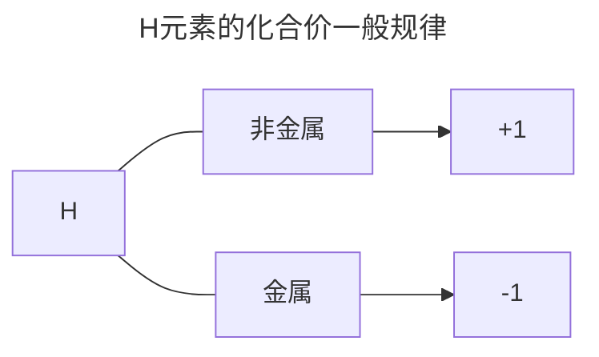

# 化合价判断能力

## 化合价一般规律

1. 化合价是元素在**形成化合物**时表现出的性质，所以**单质的化合价为零**
2. 有些元素在化合物中的化合价只有一种，判断时优先决定，如：
   1. 化合物中永远显正一价的$\ce {Ag、Li、Na、K、Rb、Cs}$等等
   2. 化合物中永远显正二价的$\ce {Zn、Mg、Ca、Sr、Ba}$等等
   3. 化合物中永远显正三价的$\ce {Al}$等等
   4. 化合物中永远显负一价的$\ce {F}$
3. H元素

​	以上规律只是**一般规律**，仍然有特例存在，如：

​	$\ce {SiH4、B2H6}$中的H都显-1价

4. O元素
   1. 常见为-2价
   2. 过氧化物中的为-1价
   3. 超氧化物如$\ce {KO2}$中为$-\frac{1}{2}$价
   4. $\ce {OF2}$和$\ce {O2F2}$中的O分别显+2价和+1价

|            | IVA(C、Si) | VA(N、P) | VIA(S) | VIIA(Cl、Br、I) |
| :--------: | :--------: | :------: | :----: | :-------------: |
| 最高化合价 |     +4     |    +5    |   +6   |       +7        |
| 最低化合价 |     -4     |    -3    |   -2   |       -1        |

Ti、V、Cr、Mn的最高价分别为：+4、+5、+6、+7