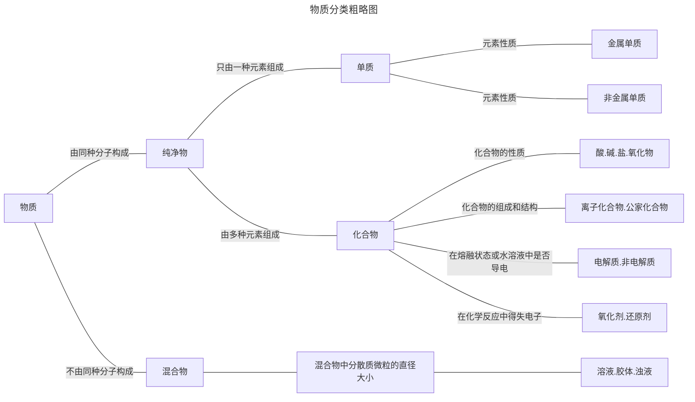
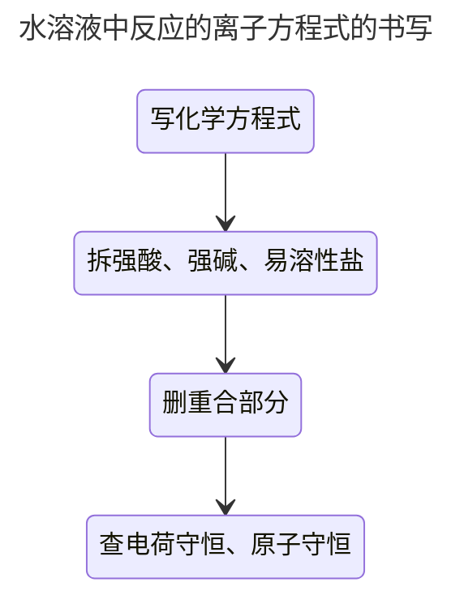
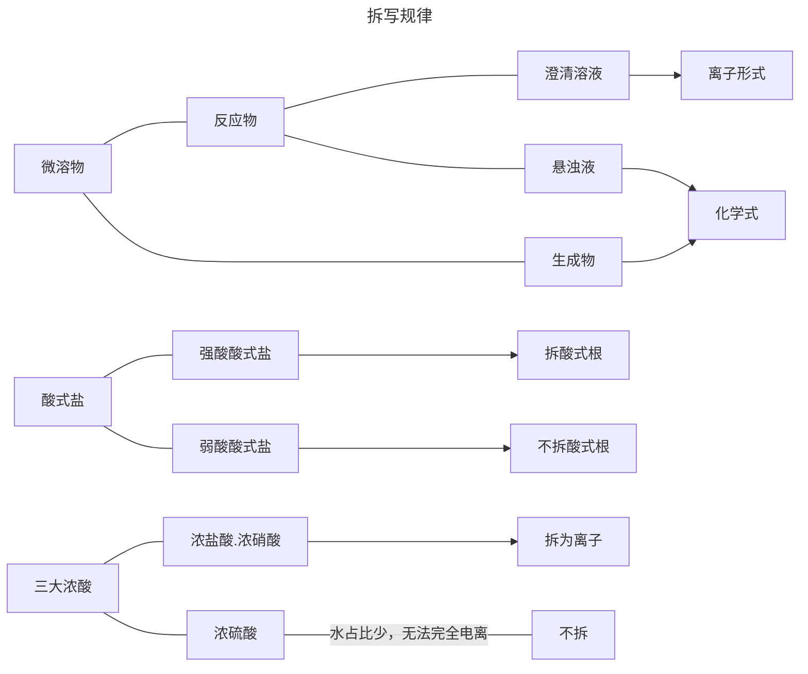
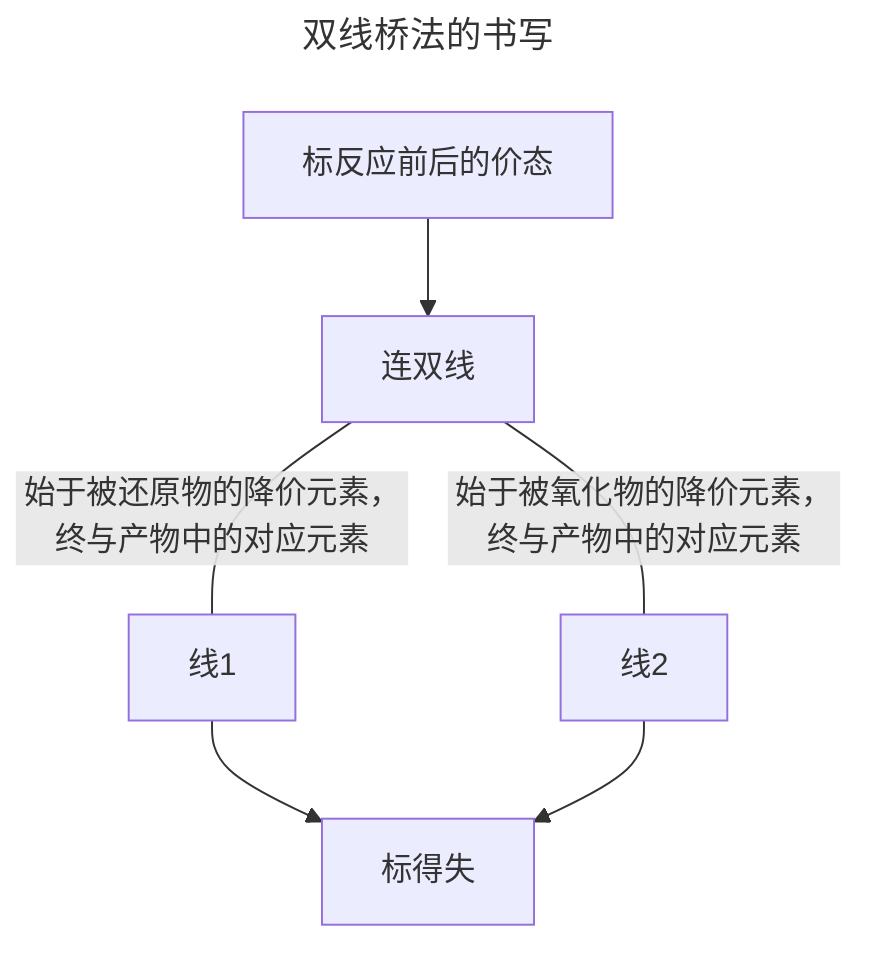
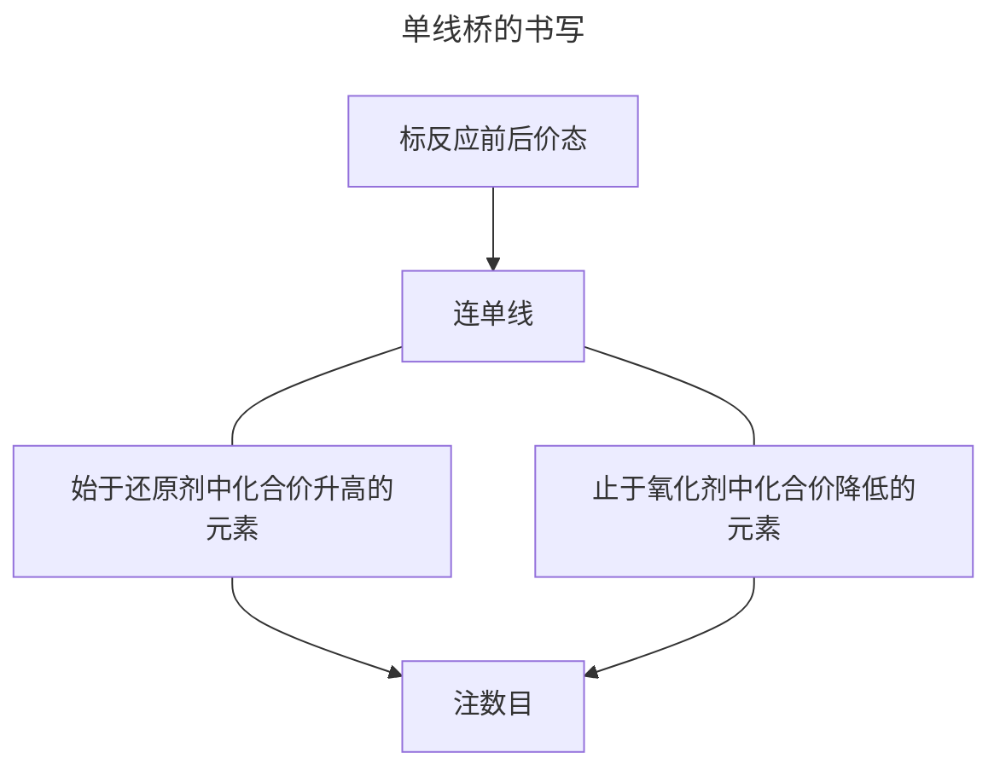

# 物质的分类与转化

## 物质的分类

1. 任何物质都是由**元素**组成的

   根据**元素组成**对物质进行分类是化学研究的基础

2. 单质：只由**一种元素**组成的**纯净物**

   化合物：由**多种元素**组成的**纯净物**

3. 元素在物质中存在的形态：

   1. 游离态：元素以**单质形式**存在的状态
   2. 化合态：元素以**化合物形式**存在的状态

4. 同素异形体

   1. **同种元素**形成的不同**单质**叫做**同素异形体**

      同素异形体的形成有两种方式：

      1. 原子个数不同，如$\text O_2$和$\text O_3$
      2. 原子排列方式不同，如金刚石和石墨

      

   2. 同素异形体之间的性质差异主要体现在**物理性质**上

      同素异形体之间的转化属于**化学变化**



氧化物的定义：
	氧元素和另一化学元素组成的**二元化合物**

 ```mermaid
 ---
 title: 氧化物分类图
 ---
 graph LR
 	氧化物 --- 按组成元素分 --- 金属氧化物 & 非金属氧化物
 	氧化物 --- 按性质分 --可以通过化学反应转化为盐 ---成盐氧化物
 	氧化物 --- 按性质分 --不可以通过化学反应转化为盐 ---不成盐氧化物
 	成盐氧化物 --与碱反应生成一种盐和水 --- 酸性氧化物
 	成盐氧化物 --与酸反应生成一种盐和水 --- 碱性氧化物
 	成盐氧化物 --与酸和碱都反应生成一种盐和水 --- 两性氧化物
 	按性质分 --- 特殊氧化物
 ```

1. 常见的**酸性氧化物**：一般是**非金属元素的氧化物**和某些**过渡金属元素的高价氧化物**

​	$\text {CO}_2、\text{SO}_2、\text {SO}_3、\text{Mn}_2\text{O}_7、\text{P}_2\text O_5、\text{SiO}_2$

​	其中$\text{Mn}_2\text{O}_7$也是**金属氧化物**，$\text{SiO}_2$**不溶于水**

2. 常见的**碱性氧化物**：包括**活泼金属氧化物**和**其他金属的低价氧化物**

   $\text{Na}_2\text{O}、\text{CaO}、\text{BaO}、\text{MgO}$

   所有碱性氧化物都是**金属氧化物**

3. 常见的**两性氧化物**：

   $\text{Al}_2\text{O}_3、\text{ZnO}、\text{BeO}、\text{Cr}_2\text{O}_3$

4. 常见的不**成盐氧化物**：

   $\text{CO}、\text{NO}、\text{H}_2\text{O}$

## 分散系与胶体

1. 概念：把一种（或多种）物质以**粒子形式**分散到另一种（或多种）物质中形成的**混合物**

2. 分散系中被分散成粒子的物质叫做**分散质**，另一种叫做**分散剂**

3. 根据分散粒子的直径大小：

   ```mermaid
   ---
   title: 分散系质粒子直径和分散系的关系
   ---
   graph LR
       A[/0nm\] <-- 溶液 --->B[/1nm\] <-- 胶体 --->C[/100nm\] <-- 浊夜 ---> 正无穷nm
   ```

   

| 分散系             | 溶液             | 胶体                 | 浊夜                 |
| ------------------ | ---------------- | -------------------- | -------------------- |
| 分散质粒子直径     | 小于1nm          | 1nm到100nm           | 大于100nm            |
| 分散质粒子         | 单个小分子或离子 | 多粒子集合体或大分子 | 巨大数目的粒子集合体 |
| 外观               | 均一、透明       | 多数均一、透明       | 不均一、不透明       |
| 稳定性             | 稳定             | 介稳体系             | 不稳定               |
| 粒子能否透过滤纸   | 能               | 能                   | 不能                 |
| 粒子能否透过半透膜 | 能               | 不能                 | 不能                 |
| 实例               | 盐酸             | 氢氧化铁胶体         | 石灰乳               |

胶体的制备原理：

1. 具体操作：往烧杯中加入40mL蒸馏水，将烧杯中的蒸馏水加热至**沸腾**,向沸水中逐滴加入5～6滴$\ce {FeCl3}$**饱和溶液**，继续煮沸至溶液呈**红褐色**，停止加热.
1. 化学方程式：$\ce {FeCl3 + 3H2O ->T[加热]Fe(OH)3(胶体) + 3HCl}$
1. 粒子方程式：$\ce {Fe^3+ + 3H2O ->T[加热] Fe(OH)3(胶体) + H^3+}$

注意事项：

1. 不能用自来水代替蒸馏水，自来水中的**离子**会导致胶体**聚沉**
2. 当溶液呈红褐色时需停止加热，否则**加热过度**会导致胶体沉淀
3. 边加边振荡烧杯，但**不能用玻璃棒搅拌**，否则胶体会沉淀


| 胶体的性质 | 内容                                                         | 主要应用           |
| ---------- | ------------------------------------------------------------ | ------------------ |
| 丁达尔效应 | 因为胶体粒子的大小刚刚合适，会对**光线散射**（使光波偏离原方向发散传播），所以当光束穿过胶体时，会看见一道**清晰的光柱**，这种现象叫做**丁达尔效应** | **鉴别**溶液和胶体 |
| 电泳现象   | 胶体在外加电场的作用下做定向移动（**胶体带电**，如$\ce {Fe(OH)3}$胶粒带正电，$\ce {H2SiO3}$带负电） | 工厂静电除尘       |
| 聚沉       | 胶体粒子**聚集为较大颗粒**，形成沉淀从分散剂中析出的过程.<br />常见的聚沉方法：加热、加电解质、加入和胶体粒子带相反电荷的胶体 | 制豆腐、工业制肥皂 |
| 渗析       | 由于胶体粒子直径较大不能穿过**半透膜**，可以用半透膜来提纯胶体 | 净化、精制胶体     |

光的散射：


静电除尘：


# 离子反应

## 电解质基本概念

电解质与非电解质定义：

1. 电解质：在**水溶液**里‘或’**熔融状态**下能够导电的化合物

2. 非电解质：在在**水溶液**里‘和’**熔融状态**下都不能导电的化合物

3. 电解质与非电解质的相同之处：他们都是**化合物**

   > 单质、混合物既不属于电解质也不属于非电解质

4. 电解质一定是**本身含有离子**或**能电离出离子的化合物**. 通过与水反应后才能导电的化合物不是电解质，而是非电解质，如$\ce {SO2、SO3、CO2、NH3}$等.


电离：电解质溶于水或受热熔化时，形成**自由移动离子**的过程.

* 水中形成**水合离子**


* 熔融状态下，运动剧烈，**摆脱束缚**


强电解质与弱电解质：

1. 强电解质：在水溶液中或熔融状态下能**完全电离**的电解质

   1. 强酸：$\ce {HCl、H2SO4、HNO、HBr、HI、HClO4}$ (盐硫硝溴碘高)

   2. 强碱：$\ce {KOH、NaOH、Ca(OH)2、Ba(OH)2}$ (钾钠钙钡)

   3. 大多数盐

   4. 活泼金属氧化物：$\ce {Na2O、MgO、CaO、Al2O3}$

2. 弱电解质：溶于水后只能**部分电离**的电解质

   1. 弱酸
   2. 弱碱
   3. 水


强电解质与弱电解质重要概念：

1. 划分强、弱电解质的唯一标准是看电解质**是否完全电离**
2. 电解质的强弱与其溶解性**无关**
3. 电解质的强弱与溶液的导电性**没有必然联系**，导电性的强弱取决于溶液中自由移动的**离子浓度/电荷量**


## 离子方程式

概念：用**实际参与反应的离子符号**来表示反应的式子

书写：



例：盐酸和氢氧化钠反应

1. $\ce {HCl + NaOH = H2O + NaCl}$
2. $\ce {H+ + Cl- + Na+ + OH- = H2O + Na+ + Cl-}$
3. $\ce {H+ + OH- = H2O}$
4. 验证正确

故：$\ce {H+ + OH- = H2O}$


拆写规律：

1. 强酸、强碱、易溶盐写成离子形式
2. 单质、氧化物（水溶液）、气体、难溶物、弱电解质一律写成化学式

注意事项：

1. 四大微溶物：$\ce {MgCO3 、CaSO4、AgSO4、Ca(OH)2}$

2. **微溶物**如$\ce {Ca(OH)2}$当写成**澄清石灰水时**可拆，其他时候如**石灰乳**时不可拆

3. 氧化物在**水溶液反应**时不可拆，但当在**熔融状态**下时，有些可拆



## 离子共存

1. 判断一：溶液颜色

​	当溶液无色时，**有色离子**不能大量共存

​	有色离子：

​		$\ce {Cu^2+}$：蓝色

​		$\ce {Fe^2+}$：浅绿

​		$\ce {Fe^3+}$：（棕）黄

​		$\ce {MnO4^-}$：紫

​		$\ce {CrO4^2-}$：黄

​		$\ce {Cr2O7^2-}$：橙

​	注意：

​		透明就是**分散系均一**，和**无色**不是一个意思.

2. 判断二：溶液酸碱性条件

   1. 溶液呈**强酸性**时候，与**$\ce {H+}$反应的离子**无法大量共存：
      1. 氢氧根离子：$\ce {OH-}$
      2. 弱酸根离子：$\ce {CO3^-、SO3^2-、S^2-、CH3COO^-、ClO^-、AlO2^-、F^-}$等等
   2. 溶液呈**强碱性**时候，与**$\ce {OH^-}$反应的离子**无法大量共存：
      1. 氢离子：$\ce {H+}$
      2. 铵根离子：$\ce {NH4+}$
      3. 与氢氧根形成沉淀的金属阳离子：除$\ce {K+、Na+、Ba^2+}$以外所有（注意，**氢氧化钙**也不共存）
   3. **无论**是强酸还是强碱性，都无法共存的离子：
      1. 弱酸的酸式根离子：$\ce {HCO3- 、HSO3- 、HS- 、H2PO4- 、HPO4^2- 、HC2O4-}$等等

3. 判断三：常见难溶物/微溶物

   1. 难溶物：

      1. $\ce {SO4^2-}$与$\ce {Ba^2+、Pb^2+}$
      2. $\ce {Ag+}$与$\ce {Cl- (白) 、Br- (淡黄） 、I- （黄）}$
      3. $\ce {CO3^2-、SO3^2-}$：只有和$\ce {Na+ 、 K+ 、NH4+}$**可以共存**
      4. $\ce {OH-}$：只有和$\ce {K+、Na+、Ba^2+}$**可以共存**（注意，**氢氧化钙**也不共存）

   2. 微溶物：

      ​	$\ce {MgCO3 、CaSO4、AgSO4、Ca(OH)2}$

4. 判断四：离子间发生氧化还原反应不共存

   1. $\ce {Fe^3+}$：与$\ce {S^2- 、HS- 、SO3^2- 、HSO3- 、I-}$不能大量共存
   2. $\ce {NO3- (H+)}$：与$\ce {S^2- 、HS- 、SO3^2- 、HSO3- 、I- 、Fe^2+ 、Br-}$不能大量共存
   3. $\ce {MnO4- (H+)/Cr2O7^2-(H+)/ClO- (H+)}$：与$\ce {S^2- 、HS- 、SO3^2- 、HSO3- 、I- 、Fe^2+ 、Br- 、Cl-}$不能大量共存

# 氧化还原

## 氧化还原反应基本概念

氧化反应：**失电子**，体现出**化合价升高**的反应

还原反应：**得电子**，体现出**化合价降低**的反应


氧化剂：帮助别物质氧化的物质，本身被还原，**得电子**

还原剂：帮助别物质还原的物质，本身被氧化，**失电子**

抗氧化剂：帮助别物质抵抗氧化，本身**优先**被氧化


氧化剂：物质**得电子**的能力（氧化剂的强弱）

还原性：物质**失电子**的能力（还原剂的强弱）


氧化产物：**被氧化**后生成的产物

还原产物：**被还原**后生成的产物


1. 常见氧化剂：
   1. 活泼金非属单质：$\ce {O2、Cl2、Br2、I2}$
   2. 高价金属阳离子：$\ce {Fe^3+、Cu^2+、Ag+}$
   3. 高价含氧化合物：$\ce {KMnO4、MnO2、HNO3、K2Cr2O7、H2SO4、KClO3}$
   4. 其他：$\ce {H2O2、Na2O2}$
2. 常见还原剂：
   1. 活泼或较活泼金属：K、Ca、Na、Mg、Al、Zn、Fe
   2. 某些非金属单质：$\ce {H2、C}$
   3. 低价金属阳离子：$\ce {Cu+ 、Fe^2+}$
   4. 非金属阴离子：$\ce {S^2- 、I- 、Br- 、Cl-}$
   5. 较低价化合物：$\ce {CO、 H2S 、 SO2}$
3. 氧化剂和还原剂规律：
   1. 若元素处于**最高价态**，则只表现**氧化性**，做**氧化剂**
   2. 若元素处于**最低价态**，则只表现**还原性**，做**还原剂**
   3. 若元素处于**中间价态**，则表现**氧化性又表现还原性**，既可作**氧化剂又可作还原剂**


## 电子转移的表达方式

1. 双线桥法

​	意义：表示**同一元素**反应前后的变化，体现**谁变成谁**



示例：


2. 单线桥法

   意义：表示**反应物之间**的电子转移，体现**谁给谁**



示例：


## 氧化还原反应的强弱规律

一般的氧化还原反应可以表示为：
$$
\ce {氧化剂+还原剂 -> 还原产物+氧化产物}
$$

1. 氧化性：

   ​	**氧化剂、氧化产物**具有氧化性

2. 还原性：

   ​	**还原剂、还原产物**具有还原性

因为**氧化反应不可逆**，所以在氧化反应中永远是**两强生两弱**，故：

> 氧化剂的氧化性>氧化产物
>
> 还原剂的还原性>还原产物
>
> 氧化性越强的物质得电子能力越强，对应的还原产物失电子能力越弱


反应前后规律：**极性先行**

1. 同一氧化剂与含多种还原剂（浓度相近）的溶液反应时，先氧化**还原性最强**的物质

2. 同一还原剂与含多种氧化剂（浓度相近）的溶液反应时，先还原**氧化性最强**的物质


1. 还原性顺序（被氧化的顺序）：$\ce {\overset{-2}{S} 、\overset{+4}{S}、I- 、Fe^2+、Br- 、Cl- 、Mn^2+}$   “留（硫）了一点（碘）铁生锈（溴）长绿（氯）毛（锰）”
